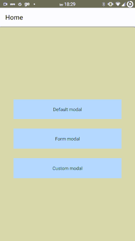

# react-navigation-modal

This is a modal component to be used together with react-navigation




## how to use

Create a component for your modal

```js
import React from 'react';
import { Text } from 'react-native';
import Modal from 'react-navigation-modal'

export const DefaultModal = () => {
  return (
    <Modal>
      <Text>Hello</Text>
    </Modal>
  );
};

```

Add your modals to your navigation just like any other screen

```js
  <Stack.Navigator headerMode="screen">
        <Stack.Screen name="Home" component={HomeScreen} />
        <Stack.Screen name="Default" component={DefaultModal} />
        <Stack.Screen name="Form" component={FormModal} />
        <Stack.Screen name="Custom" component={CustomModal} />
    </Stack.Navigator>
```

__To avoid bugs it is recommended to configure the headerMode like the example__

For open your modal just:
```js
navigation.navigate('Default')
```

More examples in
https://github.com/airtonazevedo/react-navigation-modal/tree/master/example

## Props

| Props  	| Type  	| Default<Br> value  	|  Description 	|
|---	|---	|---	|---	|
|   cancelable	| boolean  	|   true	| if the modal is canceled by pressing out  	|
| opacity  	| number (min 0 - max 1)  	| 0.7  	| opacity of the background |
| style  	| viewStyle  	|  {top: '15%', padding: 20, borderRadius: 10, backgroundColor: '#FFFFFF'} 	| modal content style

All view props

